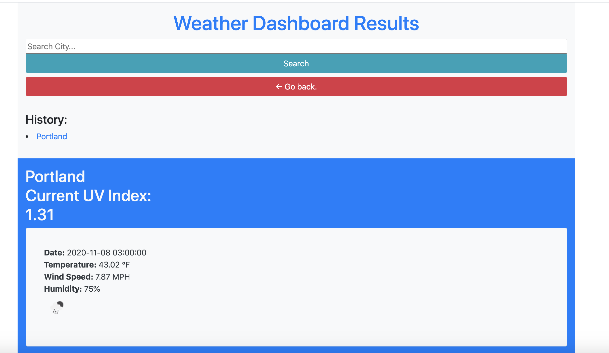

# My Weather Dashboard

## The Repository

This repository provides the landing page to my weather dashboard.

Please click the link below to open [My Weather Dashboard](https://floressuarezalvaro.github.io/weather_app/). Just type in your city name and you'll be presented with the weather in your selected city for 5 days!

## Contributing

The best way to participate in my portfolio is to [submit a bug](https://github.com/floressuarezalvaro/weather_app/issues). Additionally, you can review the [source code](https://github.com/floressuarezalvaro/weather_app/pulls) changes. Lastly, you can [build from the source itself](https://github.com/floressuarezalvaro/weather_app/wiki).

## Credits

I used Bootstrap throughout my porfolio. Please click [here](https://getbootstrap.com/) to visit the Bootstrap page. Here you'll find the same documentation I used to build my pages out. I also used the followign API to capture weather data: [Open Weather Map](https://openweathermap.org/)